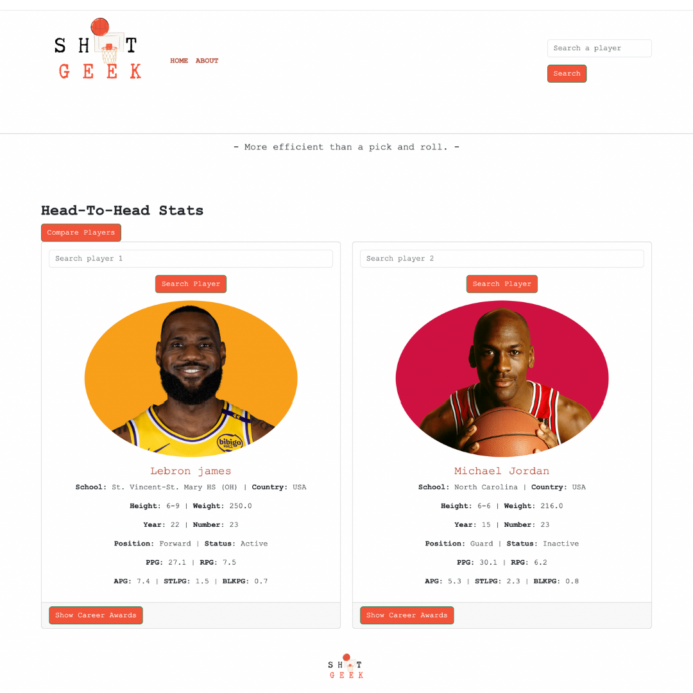

Changing a Player Card
=======================

ShotGeek allows you to easily switch between two player cards in a comparison. This feature is particularly useful for comparing players from different eras or positions.

**Steps to Search for a Player:**

To switch one of the two players in a comparison:

1. Use the search bar at the top of the player card.
2. Type the name of the new player and hit Enter.
3. Only one card (Player 1 or Player 2) can be changed at a time.

.. raw:: html

   

     <strong>Tip:</strong>Check out a player's career awards at the bottom of the card
   

**Watch it in action:**

.. raw:: html

    <video width="100%" controls style="border-radius: 12px; box-shadow: 0 4px 8px rgba(0,0,0,0.1);">
        <source src="_static/videos/change-cards.mov" type="video/mp4">
        Your browser does not support the video tag.
    </video>
