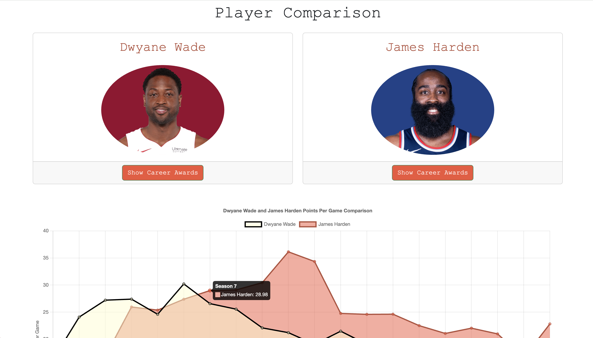

Comparing Players
==================

ShotGeek makes it easy to compare two players with clarity and depth. Here's how to do it.

**Options for comparing players:**

- View side-by-side career stats
- Select specific stat categories to graph and compare trends

.. raw:: html

   

     <strong>Tip:</strong>Compare players from different eras
   

**Watch it in action:**

.. raw:: html

    <video width="100%" controls style="border-radius: 12px; box-shadow: 0 4px 8px rgba(0,0,0,0.1);">
        <source src="_static/videos/compare.mov" type="video/mp4">
        Your browser does not support the video tag.
    </video>
