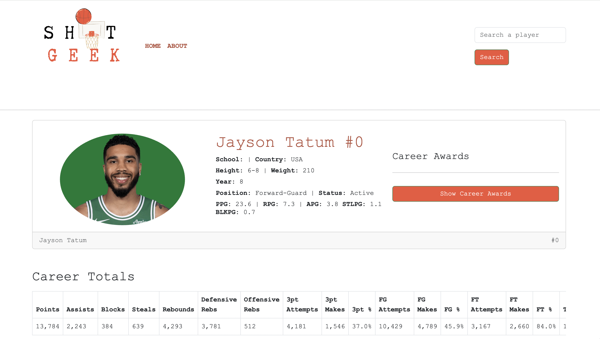

Finding a Player Page
======================

On ShotGeek, you can easily find a player's profile page using the search bar. This feature is designed to help you quickly access detailed stats and information about any current or former player in the NBA.

**Steps to Search for a Player:**

1. Enter the player's **full name** into the ShotGeek search bar.
2. Check for correct spelling — for example, use **Stephen Curry** rather than “Steph Curry.”
3. Hit Enter or click the search icon to view the player's profile page.

.. raw:: html

   

     <strong>Tip:</strong>While we work on an auto-suggest feature, please use Google to verify player spelling!
   

**Watch it in action:**

.. raw:: html

    <video width="100%" controls style="border-radius: 12px; box-shadow: 0 4px 8px rgba(0,0,0,0.1);">
        <source src="_static/videos/find-player.mov" type="video/mp4">
        Your browser does not support the video tag.
    </video>
