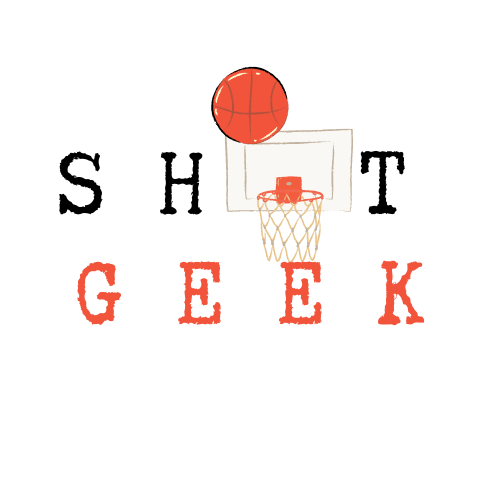

.. ShotGeek documentation master file, created by
   sphinx-quickstart on Mon May  5 21:59:55 2025.
   You can adapt this file completely to your liking, but it should at least
   contain the root `toctree` directive.

🏀 Welcome to ShotGeek's documentation! 🏀 
==========================================

Welcome to ShotGeek's User & Developer Documentation!

ShotGeek is an open-source Django application designed for basketball enthusiasts who love diving deep into NBA stats. Whether you're comparing legends like Michael Jordan to current stars like Stephen Curry, or exploring player trends across seasons, ShotGeek makes it simple and visual.

This documentation is your guide to getting the most out of the app — from searching for players to analyzing side-by-side stats and interactive graphs.

**What's inside:**

- Step-by-step user guides to help you navigate key features
- Tips on customizing your experience
- **(Coming soon) Technical documentation for developers and contributors**

We welcome your feedback and contributions as we continue to grow ShotGeek together!

.. toctree::
   :maxdepth: 2
   :caption: Contents:

   finding_players
   changing_player_card
   comparing_players
   player_table
   player_graph

Indices and tables
==================

* :ref:`genindex`
* :ref:`modindex`
* :ref:`search`

Contact
-------

We'd love to hear from you! 

Whether you’ve got feedback, feature ideas, or want to contribute to ShotGeek, you can reach us through the following platforms:

- **Email:** info@shotgeek.com  
- **Instagram:** `@shotgeekhq <https://instagram.com/shotgeekhq>`_  
- **LinkedIn:** `ShotGeek on LinkedIn <https://linkedin.com/company/shotgeek>`_  
- **Join our Slack:** `ShotGeek Community <https://join.slack.com/t/shotgeek/shared_invite/zt-33wmn5h84-TPCszJqIgZTEbIuFKFM7cg>`_  
- **GitHub:** `Contribute on GitHub <https://github.com/ShotGeek>`_

We're building ShotGeek together — one stat at a time.
