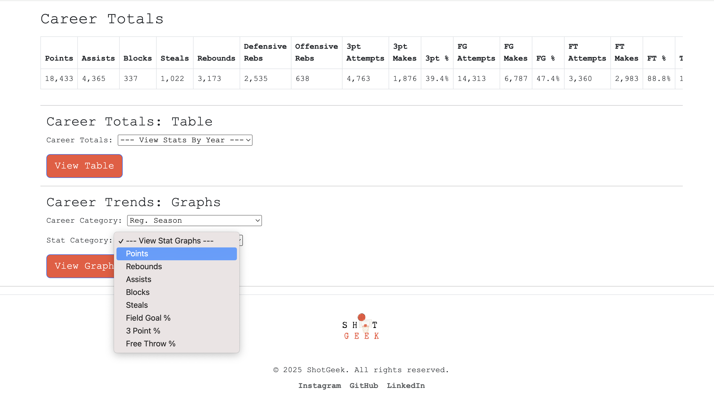

Player Graphs
===============

Dive deeper into a player's performance by exploring their stat trends in graphs directly from their profile page.

How to view a player's graph:

1. Navigate to any player's profile.
2. Scroll down to the **"Career Trends: Graph"** section.
3. Use the dropdown menu to choose a stat and career category (e.g. regular season, Points).
4. Watch the graph update to show season-by-season performance for the selected stat.

.. raw:: html

   

     <strong>Tip:</strong>Don't forget to select both a stat and a career category to see the graph!
   

.. raw:: html

    <video width="100%" controls>
        <source src="_static/videos/player-trend.mov" type="video/mp4">
        Your browser does not support the video tag.
    </video>
