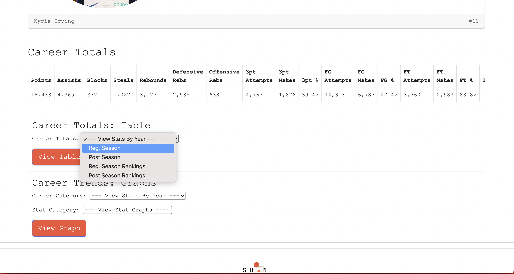

Player Table
==============

ShotGeek lets you explore a player's performance **season by season** using an interactive, easy-to-read table.

With just a few clicks, you can:

- View detailed season-by-season stats  
- Focus on specific metrics that matter to you  
- Understand performance trends across a player's career  

.. raw:: html

   

     <strong>Tip:</strong>You can scroll left and right on the table to see all the stats.
   

**🎥 Watch it in action:**

.. raw:: html

    <video width="100%" controls style="border-radius: 12px; box-shadow: 0 4px 12px rgba(0,0,0,0.1); margin-top: 1em;">
        <source src="_static/videos/player-table.mov" type="video/mp4">
        Your browser does not support the video tag.
    </video>
